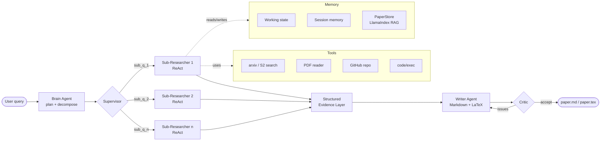

<div align="center">

# DeepScholar

**An open-source Deep Research agent for academic literature, surveys, and code-grounded reports.**

[](LICENSE)
[](https://www.python.org/downloads/)
[](README.zh-CN.md)

</div>

DeepScholar is an open-source take on the **Deep Research** application pattern popularized by OpenAI / Gemini / Perplexity, focused on the academic and engineering use case: given a high-level question, the agent searches papers, reads PDFs, optionally pulls reference repositories, and produces a structured Markdown / LaTeX report with grounded citations.

It is designed as a **transparent, hackable reference implementation** of the patterns that make modern research agents work — ReAct loops, hierarchical memory, retrieval-augmented generation, supervisor-driven parallelism, and critic reflection — so you can read the code, swap parts out, and build your own variant.

---

## Highlights

- **ReAct executor** — `Thought → Action → Observation` loop with a typed tool registry (MCP-compatible).
- **Hierarchical memory** — *Working* (graph state) + *Session* (cross-run cache) + *Knowledge* (LlamaIndex vector store with section-level chunking).
- **Supervisor + parallel sub-researchers** — the brain decomposes the question into sub-questions and dispatches sub-researchers in parallel; results are compressed into a structured Evidence layer before being handed to the writer.
- **Critic reflection loop** — survey output is graded across coverage / organization / analysis / writing; the writer is re-invoked with normalized issues until the critic accepts (with a max-loop guard).
- **Multi-model routing** — `litellm`-based router with exponential backoff and per-task token budgets; you can mix OpenAI, Anthropic, and local models per node.
- **Citation grounding** — papers are tracked in a `PaperStore` and injected into prompts so the writer can only cite sources actually retrieved, eliminating hallucinated references.
- **Two execution engines** — a fixed LangGraph DAG (`--engine classic`) and a dynamic ReAct loop (`--engine react`); pick determinism vs. flexibility per task.
- **Optional LangSmith observability** — drop a `LANGSMITH_API_KEY` into `.env` and every Thought / Action / Observation, model call, and sub-researcher fan-out shows up as a trace.

---

## Architecture



**Data flow in one line:** *Brain decomposes → Supervisor fans out parallel ReAct sub-researchers → Evidence is compressed → Writer drafts Markdown + LaTeX → Critic loops until acceptable.*

---

## Quickstart

### 1. Install

```bash
git clone https://github.com/tyxu2/DeepScholar.git
cd DeepScholar
python -m venv .venv && source .venv/bin/activate
pip install -e .
```

### 2. Configure

```bash
cp .env.example .env
# edit .env and set OPENAI_API_KEY (and optionally ANTHROPIC_API_KEY, GITHUB_TOKEN, …)
```

### 3. Run

```bash
# Interactive natural-language prompt
deepscholar

# One-shot: produce a survey on a topic
deepscholar run "Survey recent advances in long-context attention"

# Use the dynamic ReAct engine
deepscholar run --engine react "Compare speculative decoding methods"

# Inspect the registered tools
deepscholar tools list
```

### Optional: LangSmith tracing

```bash
pip install -e ".[langsmith]"
echo 'LANGSMITH_API_KEY=lsv2_pt_...' >> .env
echo 'LANGSMITH_PROJECT=deepscholar' >> .env
deepscholar run "..."   # traces appear at https://smith.langchain.com
```

Tracing is **fully optional** — without `LANGSMITH_API_KEY` the agent runs unchanged.

---

Outputs are written to `./output/`:

```
output/
├── paper.md       # Markdown report with citations
├── paper.tex      # LaTeX paper (compile with latexmk / tectonic)
└── trace.jsonl    # ReAct trace (Thought / Action / Observation)
```

---

## Repository layout

```
research_agent/
├── agents/        # brain · executor · writer · critic
├── react/         # ReAct executor + skill registry
├── runtime/       # sub-researcher, replan, structured response
├── planning/      # heuristics for plan selection
├── memory/        # paper_store, session_memory, conversation_memory
├── llm/           # multi-model router with retry
├── tools/         # MCP-compatible tool registry + builtins
├── writer/        # Markdown / LaTeX writers
├── eval/          # critic-style evaluator
├── prompts/       # system prompts (overridable via templates/)
└── cli.py         # Typer CLI

docs/              # AGENT_RULES.md + per-agent rule contracts
templates/         # paper.tex.j2 + prompt overrides
```

The agent contracts (state schema, evidence layer, supervisor / writer rules) are documented in [docs/AGENT_RULES.md](docs/AGENT_RULES.md) and [docs/rules/](docs/rules/).

---

## Status & roadmap

DeepScholar is a working prototype. The patterns are stable; the surface API is not.

- [x] LangGraph DAG + ReAct dual engine
- [x] Supervisor with parallel sub-researchers
- [x] Critic reflection loop with normalized rubric (survey doc-type)
- [x] LlamaIndex RAG with section-level chunking
- [x] Citation grounding via `PaperStore.get_citation_list()`
- [x] Multi-model router with exponential backoff
- [ ] **English-only codebase** (prompts / comments) — *in progress*
- [ ] Tool-call streaming + token-level tracing UI
- [ ] Pluggable retriever backend (currently OpenAI embeddings)
- [ ] First-class evaluation harness (factuality, citation precision)
- [ ] Web UI with live Thought / Action / Observation stream
- [ ] Hosted demo

Contributions and issues are very welcome — please see [docs/AGENT_RULES.md](docs/AGENT_RULES.md) before changing agent contracts.

---

## License

MIT — see [LICENSE](LICENSE).

## Acknowledgements

DeepScholar stands on the shoulders of [LangGraph](https://github.com/langchain-ai/langgraph), [LlamaIndex](https://github.com/run-llama/llama_index), [LiteLLM](https://github.com/BerriAI/litellm), and the broader Deep Research / ReAct research community.
