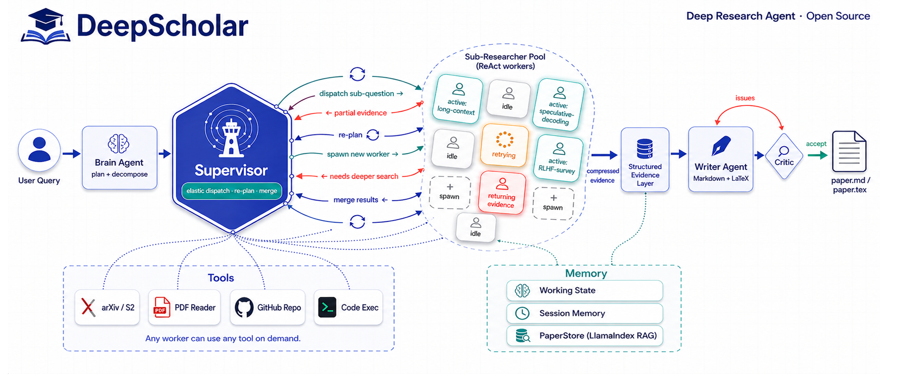

<div align="center">

# DeepScholar

**面向学术文献调研、综述写作和代码可追溯报告的开源 Deep Research Agent。**

[](LICENSE)
[](https://www.python.org/downloads/)
[](README.md)

</div>

DeepScholar 是 **Deep Research 应用场景**（OpenAI / Gemini / Perplexity 等产品所代表的范式）的一个开源参考实现，聚焦学术与工程方向：给一个高层次问题，Agent 自动检索论文、阅读 PDF、必要时拉取参考仓库，最终输出一份带可追溯引用的 Markdown / LaTeX 报告。

它的定位是 **透明、可改造的现代 Research Agent 参考实现**——把 ReAct 循环、分层记忆、检索增强生成、Supervisor 并行与 Critic 反思这些关键 pattern 用最直接的方式拼出来，让你能读懂、能替换、能自己拉一个分支去演化。

---

## 亮点

- **ReAct 执行器** — `Thought → Action → Observation` 循环，配套类型化的工具注册表（MCP 兼容）。
- **分层记忆** — *Working*（图状态） + *Session*（跨 run 缓存） + *Knowledge*（LlamaIndex 向量库 + 章节级分块）。
- **Supervisor + 并行 Sub-Researchers** — Brain 把问题拆成子问题，Supervisor 并行派发多个 Sub-Researcher，结果被压缩进一个结构化的 Evidence 层后再交给 Writer。
- **Critic 反思循环** — 综述按 coverage / organization / analysis / writing 四维评分，Writer 拿规范化后的 issue 重写，直到 Critic 通过（带最大循环保护）。
- **多模型路由** — 基于 `litellm` 的 router，指数退避重试 + 按任务设定的 token 预算；可以给不同节点配不同的 OpenAI / Anthropic / 本地模型。
- **引用 Grounding** — 论文统一进 `PaperStore`，写作时把真实论文清单注入 prompt，从源头杜绝虚构引用。
- **双执行引擎** — 固定 DAG（`--engine classic`） 与 动态 ReAct 循环（`--engine react`），按任务在确定性和灵活度之间切换。
- **可选 LangSmith 可观测** — 在 `.env` 里塞一个 `LANGSMITH_API_KEY`，每条 Thought / Action / Observation、模型调用、Sub-Researcher 派发都会自动上报成 trace。

---

## 架构图



**一句话数据流：** Brain 拆解 → Supervisor 弹性调度 ReAct Sub-Researcher 池（含 re-plan / 重新派发循环）→ Evidence 压缩 → Writer 起草 Markdown + LaTeX → Critic 循环直到通过。

---

## 快速开始

### 1. 安装

```bash
git clone https://github.com/tyxu2/DeepScholar.git
cd DeepScholar
python -m venv .venv && source .venv/bin/activate
pip install -e .
```

### 2. 配置

```bash
cp .env.example .env
# 编辑 .env，至少设置 OPENAI_API_KEY（可选 ANTHROPIC_API_KEY、GITHUB_TOKEN 等）
```

### 3. 运行

```bash
# 交互模式
deepscholar

# 一次性生成综述
deepscholar run "调研近期长上下文 attention 的进展"

# 用动态 ReAct 引擎
deepscholar run --engine react "对比 speculative decoding 各类方法"

# 查看已注册工具
deepscholar tools list
```

### 可选：LangSmith 追踪

```bash
pip install -e ".[langsmith]"
echo 'LANGSMITH_API_KEY=lsv2_pt_...' >> .env
echo 'LANGSMITH_PROJECT=deepscholar' >> .env
deepscholar run "..."   # 追踪会出现在 https://smith.langchain.com
```

不设 `LANGSMITH_API_KEY` 时完全不影响运行——是纯可选功能。

---

输出位于 `./output/`：

```
output/
├── paper.md       # 带引用的 Markdown 报告
├── paper.tex      # LaTeX 论文（latexmk / tectonic 编译）
└── trace.jsonl    # ReAct 推理 trace
```

---

## 仓库结构

```
research_agent/
├── agents/        # brain · executor · writer · critic
├── react/         # ReAct 执行器 + skill 注册
├── runtime/       # sub-researcher、replan、structured response
├── planning/      # 启发式 plan 选择
├── memory/        # paper_store、session_memory、conversation_memory
├── llm/           # 多模型 router（含 retry）
├── tools/         # MCP 兼容的工具注册表 + 内置工具
├── writer/        # Markdown / LaTeX writer
├── eval/          # critic 风格评估器
├── prompts/       # 系统提示词（可被 templates/ 覆盖）
└── cli.py         # Typer CLI

docs/              # AGENT_RULES.md + 各 agent 契约
templates/         # paper.tex.j2 + prompt 覆盖样例
```

Agent 契约（state schema、Evidence 层、Supervisor / Writer 规则）见 [docs/AGENT_RULES.md](docs/AGENT_RULES.md) 与 [docs/rules/](docs/rules/)。

---

## 状态与路线图

DeepScholar 现阶段是一个能跑通的原型——pattern 已稳定，对外 API 还会演化。

- [x] LangGraph DAG + ReAct 双引擎
- [x] Supervisor 并行 Sub-Researchers
- [x] Critic 反思循环 + 综述规范化评分
- [x] LlamaIndex RAG + 章节级分块
- [x] 通过 `PaperStore.get_citation_list()` 实现引用 grounding
- [x] 多模型路由 + 指数退避重试
- [ ] **代码全英文化**（prompt / 注释）—— *进行中*
- [ ] 工具调用流式输出 + token 级 trace UI
- [ ] 可插拔 retriever 后端（当前默认 OpenAI embedding）
- [ ] 一等公民的评估框架（事实性、引用准确率）
- [ ] Web UI 实时展示 Thought / Action / Observation
- [ ] 在线 demo

欢迎 issue 与 PR——改动 agent 契约前请先看 [docs/AGENT_RULES.md](docs/AGENT_RULES.md)。

---

## License

MIT，见 [LICENSE](LICENSE)。

## 致谢

DeepScholar 站在 [LangGraph](https://github.com/langchain-ai/langgraph)、[LlamaIndex](https://github.com/run-llama/llama_index)、[LiteLLM](https://github.com/BerriAI/litellm) 以及更广泛的 Deep Research / ReAct 研究社区的肩膀上。
